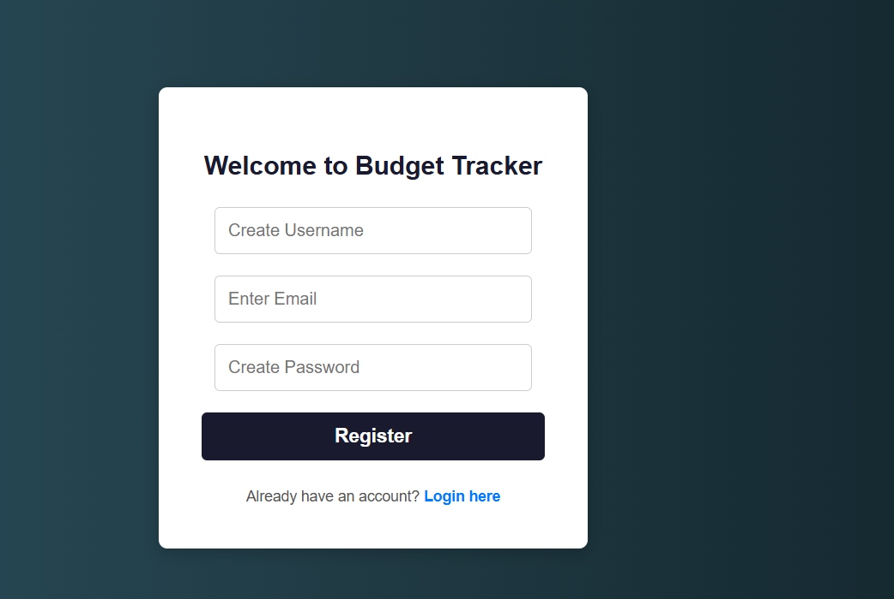
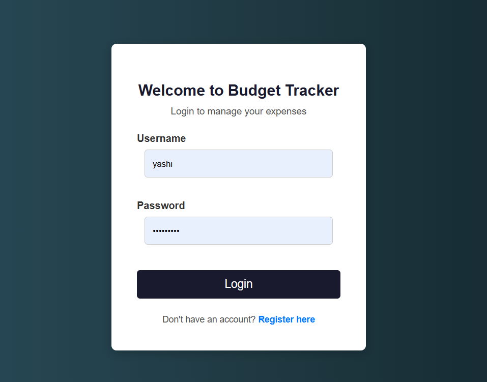
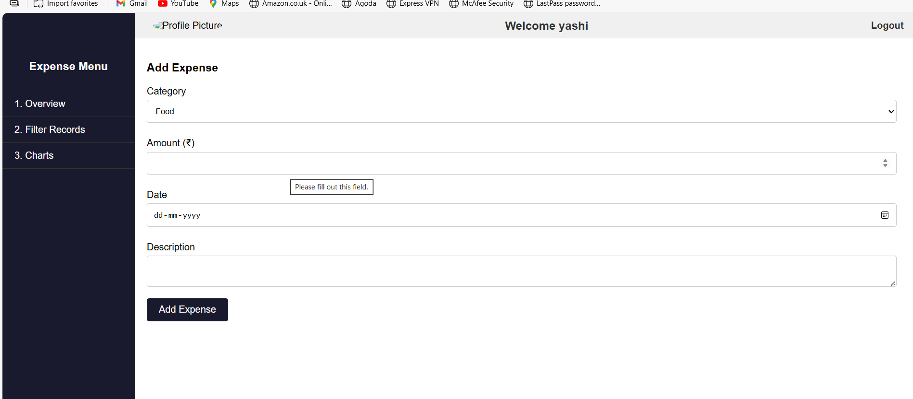
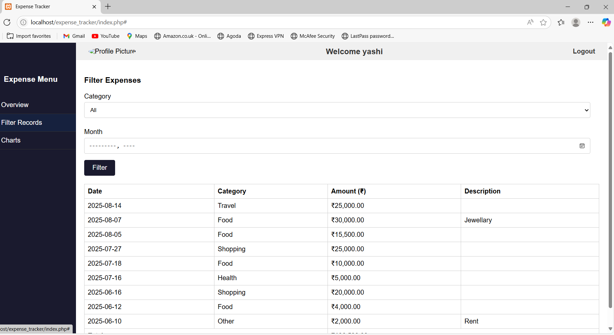
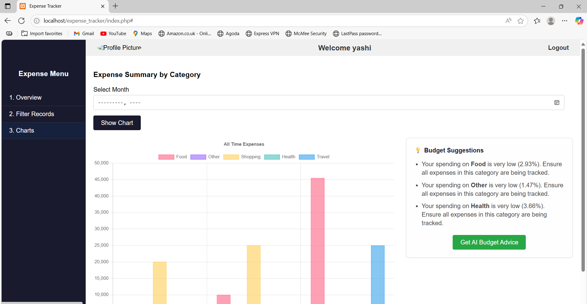

# GenAi_Expense_tracker
-Personal Budget AI Advisor

This project includes a feature that provides personalized budget advice and financial tips powered by the **OpenAI ChatGPT API**. It helps users understand their spending habits and receive actionable suggestions for better financial management.

## Features

* **Personalized Advice:** Generates budget advice based on user's expense data and selected month.
* **Actionable Tips:** Focuses on practical steps and potential areas for savings.
* **Concise Output:** Advice is presented as a clear, bulleted list for easy understanding.
* **OpenAI Integration:** Utilizes the robust and powerful ChatGPT models for AI-driven insights.

## Technologies Used

* **Frontend:** HTML, CSS, JavaScript
* **Backend:** PHP (for server-side logic and API calls)
* **Database:** MYSql
* **Web Server:** Apache (typically via XAMPP/WAMP)
* **AI API:** OpenAI (ChatGPT models like `gpt-3.5-turbo`)

## Setup Instructions

Follow these steps to get the AI budget advisor feature running locally:

### 1. Prerequisites

* **XAMPP/WAMP:** Ensure you have XAMPP (for Windows/Linux) or WAMP (for Windows) installed and running, with Apache and PHP enabled.
* **PHP cURL Extension:** The `curl` PHP extension must be enabled in your `php.ini` file. (Refer to your XAMPP/WAMP documentation on how to do this if needed).
* **OpenAI Account & API Key:**
    * Create an account on the [OpenAI Platform](https://platform.openai.com/signup).
    * Navigate to the [API Keys](https://platform.openai.com/api-keys) section.
    * Generate a new **Secret Key** (it will start with `sk-`). **Copy this key immediately** as it will only be shown once.
    * **Important:** Note that OpenAI API usage incurs costs based on tokens consumed. New accounts usually receive free trial credits, but these are limited. The "429: Quota exceeded" error means you've used up your available credits. You will need to add billing details to continue usage after free credits are exhausted.

### 2. Project Setup

1.  **Place Project Files:**
    * Copy your entire project folder (containing `index.php`, `get_ai_advice.php`, `db.php`, etc.) into your XAMPP `htdocs` directory (e.g., `C:\xampp\htdocs\YourProjectName`).

2.  **Configure OpenAI API Key:**
    * In your project folder, create a new file named `openai_key.php`.
    * Add the following content to `openai_key.php`, replacing `YOUR_OPENAI_API_KEY_HERE` with the actual secret key you obtained from OpenAI:

        ```php
        <?php
        $openai_api_key = "YOUR_OPENAI_API_KEY_HERE";
        ?>
        ```
    * **Save `openai_key.php`.**

3.  **Ensure `get_ai_advice.php` is Correct:**
    * Verify that your `get_ai_advice.php` file contains the correct OpenAI API integration code. It should look like the complete code provided in our recent discussion. This file handles sending the user's expense data to OpenAI and receiving the AI-generated advice.

### 3. Run the Application

1.  **Start Apache:** Ensure your Apache web server is running from your XAMPP/WAMP Control Panel.
2.  **Access in Browser:** Open your web browser and navigate to your project's `index.php` file.
    * Example: `http://localhost/YourProjectName/index.php` (replace `YourProjectName` with your actual folder name).
3.  **Test AI Feature:** Log in to your application and click the "Get AI Budget Advice" button.

### Troubleshooting

* **"Error connecting to AI. Please check your network or try again later."**:
    * **PHP Errors:** Ensure PHP error reporting is enabled in `php.ini` (`display_errors = On`, `error_reporting = E_ALL`) and restart Apache. Then, try accessing `http://localhost/YourProjectName/get_ai_advice.php` directly in your browser. Any PHP errors will be displayed, helping you pinpoint issues.
    * **File Not Found (404 from Apache):** Double-check that `get_ai_advice.php` is correctly placed in your project folder and that the URL you are using matches your folder name exactly (including capitalization).
    * **cURL Not Enabled:** Verify that the `curl` PHP extension is enabled in your `php.ini`. You can test this by creating a simple PHP file with `<?php if (function_exists('curl_init')) { echo "cURL is enabled!"; } else { echo "cURL is NOT enabled!"; } ?>`.

* **"OpenAI API Error (429): You exceeded your current quota..."**:
    * This means you have run out of OpenAI API credits.
    * Go to your [OpenAI Usage dashboard](https://platform.openai.com/usage) and either add a payment method or check your spending limits.

## Application Screenshots

Here are some screenshots to illustrate the different parts of the application:

---

### Register Page

* **Purpose:** Allows new users to create an account.


### Login Page

* **Purpose:** Users can log in to access their budget tracker.


### Overview/Dashboard

* **Purpose:** allow to enter their expenses .


### Filter Options

* **Purpose:** Users can filter their expenses by month or category.


### Charts/Graphs

* **Purpose:** Visual representation of spending habits.


---

## How it Works (Brief Technical Overview)

1.  The `index.php` (client-side JavaScript) collects the user's expense `chartData`, `username`, and `selectedMonth`.
2.  It sends this data via an `AJAX (fetch)` POST request to `get_ai_advice.php`.
3.  `get_ai_advice.php` receives the data, constructs a detailed prompt for the AI based on the user's financial information, and includes your `openai_api_key`.
4.  It uses PHP's `cURL` library to make an HTTPS POST request to the OpenAI Chat Completions API endpoint (`https://api.openai.com/v1/chat/completions`).
5.  The request includes the prompt as a "user message" and a "system message" to guide the AI's role (financial advisor).
6.  OpenAI processes the request using the specified model (`gpt-3.5-turbo` by default).
7.  The AI generates budget advice, which is sent back to `get_ai_advice.php` in a JSON response.
8.  `get_ai_advice.php` parses this JSON response, extracts the advice, and sends it back to the client-side JavaScript.
9.  The JavaScript then displays the advice on the webpage.
